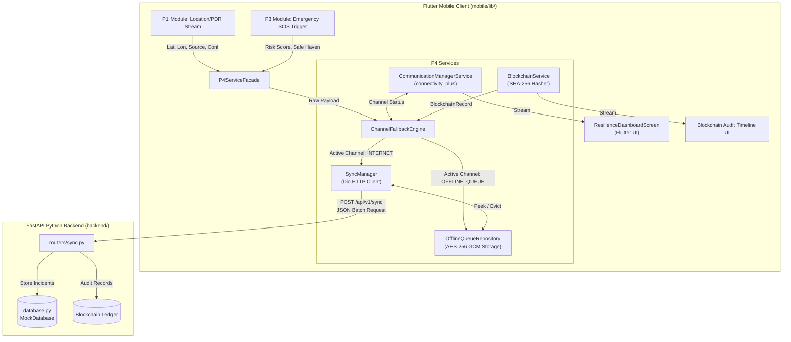

# 🛰️ Comprehensive Branch Overview (`Krish` Branch)
## Task P4: Communication Resilience & Tamper-Evident Blockchain Ledger

This document provides both a **high-level overview (in plain language)** and **deep technical specifications** for everything created and working in the `Krish` branch.

---

## 📑 Table of Contents
1. [💡 High-Level Summary (Plain Language)](#-1-high-level-summary-plain-language)
2. [📐 System Architecture & Data Flow](#-2-system-architecture--data-flow)
3. [⚙️ Deep Technical Implementation & Service Design](#-3-deep-technical-implementation--service-design)
4. [🔒 Cryptography, Security & Blockchain Specification](#-4-cryptography-security--blockchain-specification)
5. [🌐 Data Schemas & API Contracts](#-5-data-schemas--api-contracts)
6. [📁 Comprehensive File & Code Directory](#-6-comprehensive-file--code-directory)
7. [🚀 Execution & Testing Instructions](#-7-execution--testing-instructions)

---

## 💡 1. High-Level Summary (Plain Language)

### What does Task P4 do?
When tourists travel to remote regions, deserts, or dense forests, mobile network coverage can suddenly disappear. If an emergency occurs (like an SOS trigger or injury), traditional emergency apps fail because they rely solely on active internet connections.

**Task P4 solves this by building a multi-channel safety net:**
1. **Zero-Loss Emergency Alerting**: The app dynamically switches transport modes depending on signal availability (**Internet ➔ Cellular SMS ➔ Peer-to-Peer Bluetooth Mesh Relay ➔ AES-256 Encrypted Phone Memory**).
2. **Automatic Syncing**: As soon as any network connection is detected, saved offline emergency alerts automatically flush to the emergency dispatch backend.
3. **Tamper-Evident Blockchain Verification**: Every SOS signal generates cryptographic hashes stored on a blockchain ledger, ensuring emergency records cannot be altered or faked after the fact.

---

## 📐 2. System Architecture & Data Flow



---

## ⚙️ 3. Deep Technical Implementation & Service Design

### 3.1 Mobile Client Architecture (Flutter / Dart)

The mobile subsystem relies on the **Facade Design Pattern** (`P4ServiceFacade`) to encapsulate underlying domain services:

#### 1. `CommunicationManagerService` (`mobile/lib/services/communication_manager.dart`)
* **State Management**: Listens to network state transitions using `connectivity_plus`.
* **Channel Decision Algorithm**:
  ```dart
  ConnectionChannel selectOptimalChannel() {
    if (_isInternetAvailable) return ConnectionChannel.internet;
    if (_isSmsAvailable) return ConnectionChannel.sms;
    if (_isRelayAvailable) return ConnectionChannel.peerRelay;
    return ConnectionChannel.offlineQueue;
  }
  ```
* **Reactive Stream**: Emits `CommunicationStatus` updates over a broadcast `StreamController<CommunicationStatus>`.

#### 2. `ChannelFallbackEngine` (`mobile/lib/services/fallback_engine.dart`)
* **Orchestration**:
  1. Calls `BlockchainService.recordIncidentOnChain(payload)` to mint local SHA-256 transaction hashes.
  2. Queries `CommunicationManagerService.selectOptimalChannel()`.
  3. Depending on the active channel, routes payload to REST backend via `SyncManager` or persists to local storage via `OfflineQueueRepository`.

#### 3. `OfflineQueueRepository` (`mobile/lib/services/offline_queue.dart`)
* **Encryption**: Encrypts raw JSON payloads using **AES-256 in GCM Mode** with a 32-character key and 16-byte IV using the `encrypt` Dart package.
* **Storage**: In-memory list simulating a persistent `Hive` encrypted box.
* **Atomicity**: Provides `peekAllQueuedIncidents()` and `clearSyncedIncidents(syncedIds)` for safe transaction eviction upon successful HTTP 200 backend responses.

#### 4. `SyncManager` (`mobile/lib/services/sync_manager.dart`)
* **Transport**: Configured with `Dio` HTTP client with a `connectTimeout` of 5 seconds.
* **Sync Protocol**:
  1. Peeks queued incidents from `OfflineQueueRepository`.
  2. Sends `POST /api/v1/sync` payload formatted as `SyncBatchRequestSchema`.
  3. Parses response array `processed_incident_ids`.
  4. Triggers atomic eviction in `OfflineQueueRepository` for matching incident IDs.

---

### 3.2 Backend Architecture (Python FastAPI)

#### 1. Server Configuration (`backend/main.py`)
* Built with `FastAPI(title="Tourist Safety Resilience API — P4 Backend Integration")`.
* Configured with `CORSMiddleware` (`allow_origins=["*"]`) to allow cross-origin calls from web/mobile Flutter clients.

#### 2. Data Models (`backend/models.py`)
Utilizes **Pydantic V2** schemas for strict type safety and request validation:
* `LocationEstimateSchema`: Validates `lat` (-90 to 90), `lon` (-180 to 180), `source` (`GPS`|`PDR`|`WIFI`|`LAST_KNOWN`), and `confidence` (0.0 to 1.0).
* `RiskAssessmentSchema`: Validates risk category (`LOW`|`MEDIUM`|`HIGH`|`CRITICAL`), numerical score (0 to 100), and contextual reason strings.
* `IncidentPayloadSchema`: Complete payload envelope.
* `SyncBatchRequestSchema`: Batch structure containing `device_id` and list of `queued_incidents`.
* `SyncResponseSchema`: Server response returning `status`, `synced_count`, `server_timestamp`, and `processed_incident_ids`.

#### 3. Router Handlers (`backend/routers/sync.py`)
* `POST /api/v1/sync`: Iterates over incoming batch payloads, saves each incident to the database, generates server-side `BlockchainRecordSchema` entries, and returns process status.
* `POST /api/v1/incident`: Immediate single-incident ingestion.
* `GET /api/v1/incidents`: Fetches stored incident history.
* `GET /api/v1/blockchain/records`: Returns the immutable audit ledger.

---

## 🔒 4. Cryptography, Security & Blockchain Specification

### 4.1 Cryptographic Hashes (SHA-256)
Every incident undergoes cryptographic hashing in `BlockchainService` (`mobile/lib/services/blockchain_service.dart`):

1. **Location Hash**:
   $$\text{LocationHash} = \text{SHA256}("LOC:" \parallel \text{lat.toFixed(6)} \parallel ":" \parallel \text{lon.toFixed(6)} \parallel ":" \parallel \text{timestamp.toISOString()})$$
2. **Payload Hash**:
   $$\text{PayloadHash} = \text{SHA256}(\text{JSON.stringify}(payload))$$
3. **Transaction Hash Simulation**:
   $$\text{TxHash} = \text{SHA256}(incidentId \parallel ":" \parallel timestamp.milliseconds)$$

### 4.2 Local Encryption Standard (AES-256-GCM)
* **Algorithm**: `AES` (Advanced Encryption Standard).
* **Mode**: `GCM` (Galois/Counter Mode) providing authenticated encryption (AEAD).
* **Ciphertext Encoding**: Standard Base64 string encoding for offline storage.

---

## 🌐 5. Data Schemas & API Contracts

### 5.1 Batch Sync Request Contract (`POST /api/v1/sync`)

```json
{
  "device_id": "FLUTTER_DEVICE_MOBILE_001",
  "queued_incidents": [
    {
      "incident_id": "INC-1724345678901",
      "user_id": "DEMO_TOURIST_99",
      "timestamp": "2026-08-22T20:42:00.000Z",
      "event_type": "SOS_TRIGGERED",
      "location": {
        "lat": 19.0760,
        "lon": 72.8777,
        "source": "PDR",
        "confidence": 0.63
      },
      "risk_assessment": {
        "risk": "HIGH",
        "score": 78,
        "reasons": [
          "High reported-crime concentration",
          "Low activity period"
        ]
      },
      "safe_haven": {
        "name": "Hotel ABC Lobby",
        "distance_m": 280.0
      },
      "channel_used": "OFFLINE_QUEUE",
      "blockchain_tx_hash": "0x3f4e5d6c7b8a90123456789abcdef0123456789abcdef0123456789abcdef01"
    }
  ]
}
```

### 5.2 Batch Sync Response Contract (`HTTP 200 OK`)

```json
{
  "status": "SUCCESS",
  "synced_count": 1,
  "server_timestamp": "2026-08-22T20:42:05.123456Z",
  "processed_incident_ids": [
    "INC-1724345678901"
  ]
}
```

---

## 📁 6. Comprehensive File & Code Directory

```
SIH/
├── P4_Dependencies_Contract_Spec.md  # Inter-team API & data dependency specifications
├── BRANCH_OVERVIEW.md                # Comprehensive branch summary (This document)
├── backend/                          # FastAPI Python Backend
│   ├── main.py                       # Server entry point & CORS configuration
│   ├── database.py                   # In-memory database & blockchain ledger store
│   ├── models.py                     # Pydantic schemas for data validation
│   ├── requirements.txt              # Dependencies (fastapi, uvicorn, pydantic)
│   └── routers/
│       └── sync.py                   # REST API routes (/api/v1/sync, /api/v1/incident)
└── mobile/                           # Flutter Mobile Application
    ├── pubspec.yaml                  # Dependencies (connectivity_plus, dio, encrypt, crypto, hive)
    └── lib/
        ├── main.dart                 # Flutter UI Dashboard & hardware simulation screen
        ├── p4_service_facade.dart    # Unified Facade API for Task P4
        ├── models/
        │   ├── incident_payload.dart # Dart model for emergency incidents
        │   ├── blockchain_record.dart# Dart model for verified blockchain entries
        │   └── communication_status.dart # System state data object
        └── services/
            ├── communication_manager.dart # Connectivity state stream & channel picker
            ├── fallback_engine.dart       # 4-tier communication fallback engine
            ├── offline_queue.dart         # AES-256 encrypted storage repository
            ├── sync_manager.dart          # Dio HTTP REST synchronization engine
            └── blockchain_service.dart   # SHA-256 hash generator & blockchain record minter
```

---

## 🚀 7. Execution & Testing Instructions

### 7.1 Starting the FastAPI Backend
```powershell
# 1. Navigate to backend
cd c:\Users\Krish\Python\SIH\backend

# 2. Install dependencies (if needed)
pip install -r requirements.txt

# 3. Launch server
python main.py
```
* **Interactive API Documentation**: Open `http://localhost:8000/docs` in your browser.

### 7.2 Running the Flutter Mobile Client
```powershell
# 1. Navigate to mobile
cd c:\Users\Krish\Python\SIH\mobile

# 2. Fetch packages
flutter pub get

# 3. Run application
flutter run
```

### 7.3 How to Test the Fallback Cascade in UI
1. **Test Online Sending**: Keep Internet ON, click **TRIGGER EMERGENCY SOS**. Observe channel logged as `INTERNET` and instantly recorded.
2. **Test Offline Storage**: Turn OFF Internet, SMS, and Peer Relay. Click **TRIGGER EMERGENCY SOS**. Watch the **Encrypted Offline Queue** count increase.
3. **Test Automatic Backend Sync**: Turn Internet back ON, click **FORCE BACKEND SYNC**. Watch queued packets sync with FastAPI `/api/v1/sync` and clear from memory!

---

*Document updated with full technical specs for workspace `SIH` on branch `Krish`.*
