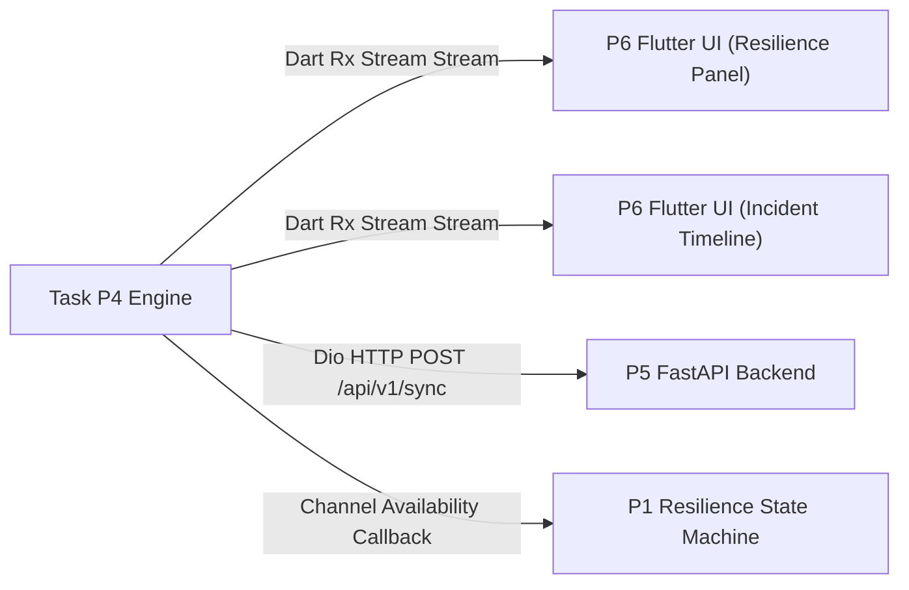

# Task P4: Dependencies & Data Contract Specification

This document details all **incoming dependencies**, **expected data formats**, and **outgoing data contracts** for **Task P4 (Communication Resilience + Blockchain)** in the **Flutter (Mobile)** and **FastAPI (Python Backend)** architecture.

---

## 1. Summary of Dependencies Used by Task P4

Task P4 consumes signals, data structures, and APIs from three primary upstream components:

| Upstream Module | Dependent Item Used by P4 | Purpose in Task P4 | Data Type / Channel |
| :--- | :--- | :--- | :--- |
| **P1 (Prachi — PDR Lead)** | `LocationEstimate` object | Appends accurate latitude, longitude, positioning source, and confidence score to every emergency incident payload. | In-Memory Dart Object / Event Stream |
| **P1 (Prachi — PDR Lead)** | PDR Hardware State | Informs P4 whether GPS is lost so P4 can adjust network packet header metadata. | In-Memory Callback / Stream |
| **P3 (Safety Intelligence)** | Emergency Triggers (`"I FEEL UNSAFE"`, `SOS_TRIGGERED`) | Signals P4 to immediately initiate high-priority packet transmission or offline queuing. | Event Signal / Method Call |
| **P3 (Safety Intelligence)** | `RiskAssessment` object & `SafeHaven` recommendation | Attached to the incident payload to send complete contextual safety data to emergency backend services. | In-Memory Dart Object |
| **P5 (Backend & Data Pipeline)** | FastAPI Schema Standards & REST Endpoints | Defines backend contracts (`POST /api/v1/sync`, `POST /api/v1/incident`) that P4 sends payloads to when connected. | HTTP REST API / JSON over TCP |

---

## 2. Expected Formats for Incoming Inputs

Task P4 expects incoming inputs from P1, P3, and P5 in the following exact data formats:

### 2.1 Format Expected from P1 (Location Estimate)

```json
{
  "lat": 19.0760,
  "lon": 72.8777,
  "source": "PDR",
  "confidence": 0.63,
  "timestamp": "2026-08-22T20:42:00Z"
}
```

* **Data Types**:
  * `lat` (double): Latitude coordinate (-90.0 to 90.0).
  * `lon` (double): Longitude coordinate (-180.0 to 180.0).
  * `source` (string): Positioning source (`"GPS"`, `"PDR"`, `"WIFI"`, `"LAST_KNOWN"`).
  * `confidence` (double): Confidence level between `0.0` and `1.0` (or `"HIGH"`, `"MEDIUM"`, `"LOW"`).
  * `timestamp` (ISO-8601 string): ISO timestamp of position capture.

### 2.2 Format Expected from P3 (Safety Risk & Incident Trigger)

```json
{
  "event_type": "SOS_TRIGGERED",
  "user_id": "USR-9942",
  "risk_assessment": {
    "risk": "HIGH",
    "score": 78,
    "reasons": [
      "High reported-crime concentration",
      "Low activity period"
    ]
  },
  "safe_haven": {
    "name": "Hotel ABC Lobby",
    "distance_m": 280,
    "lat": 19.0772,
    "lon": 72.8785
  }
}
```

* **Data Types**:
  * `event_type` (string): Incident code (`"INCIDENT_CREATED"`, `"RISK_ESCALATED"`, `"SOS_TRIGGERED"`, `"SAFE_HAVEN_SELECTED"`, `"INCIDENT_RESOLVED"`).
  * `user_id` (string): Unique tourist account identifier.
  * `risk_assessment` (object): Current risk category (`"LOW"`, `"MEDIUM"`, `"HIGH"`, `"CRITICAL"`), numerical score (0–100), and list of contextual reasons.
  * `safe_haven` (object, optional): Selected safe refuge place details.

---

## 3. How Data is Passed to Downstream Dependencies

Task P4 passes data to downstream components (**P1**, **P5**, and **P6**) using specific transport channels:



### 3.1 Passing Data to P6 (Flutter UI & Dashboard)

* **Transport Mechanism**: Reactive Dart Streams (`Stream<CommunicationStatus>` and `Stream<BlockchainRecord>`) managed via `flutter_bloc` or `Provider`.
* **Data Passed**:
  1. `CommunicationStatus`:
     ```json
     {
       "internet": false,
       "sms": false,
       "relay": true,
       "selected_channel": "RELAY",
       "queued_events_count": 3,
       "last_sync_timestamp": "2026-08-22T20:45:12Z"
     }
     ```
     *Used by P6 to render the Live System Status box (Internet: ❌, SMS: ❌, Relay: ✓, Active Channel: PEER_RELAY).*
  2. `BlockchainRecord`:
     ```json
     {
       "incident_id": "INC-1023",
       "event_type": "SOS_TRIGGERED",
       "timestamp": "2026-08-22T20:42:00Z",
       "location_hash": "0xa1b2c3d4e5f6...",
       "payload_hash": "0x89abcdef0123...",
       "tx_hash": "0x3f4e5d6c7b8a...",
       "block_number": 142857,
       "status": "VERIFIED"
     }
     ```
     *Used by P6 to display the tamper-evident green verification badge on the Incident Timeline.*

### 3.2 Passing Data to P5 (FastAPI Backend Database)

* **Transport Mechanism**: Asynchronous HTTP REST POST request using Flutter `Dio` client to FastAPI `/api/v1/sync`.
* **Data Passed** (Batch array of `IncidentPayload` objects):
  ```json
  [
    {
      "incident_id": "INC-1023",
      "user_id": "USR-9942",
      "timestamp": "2026-08-22T20:42:00Z",
      "event_type": "SOS_TRIGGERED",
      "location": {
        "lat": 19.0760,
        "lon": 72.8777,
        "source": "PDR",
        "confidence": 0.63
      },
      "risk_assessment": {
        "risk": "HIGH",
        "score": 78,
        "reasons": ["High reported-crime concentration"]
      },
      "safe_haven": {
        "name": "Hotel ABC Lobby",
        "distance_m": 280
      },
      "channel_used": "PEER_RELAY",
      "blockchain_tx_hash": "0x3f4e5d6c7b8a..."
    }
  ]
  ```
* **Backend Processing**: FastAPI validates payload via Pydantic `IncidentPayloadSchema`, saves incidents into the database, updates the incident timeline, and returns `{ "status": "synced", "processed_count": 1 }`.

### 3.3 Passing Data to P1 (Resilience State Machine)

* **Transport Mechanism**: In-Memory Dart Event Listener / Callback (`onChannelStatusChanged`).
* **Data Passed**: Boolean flag `isNetworkAvailable` and string `activeChannel`.
* **Usage**: P1 uses this to shift the system state between `FULL` / `GPS_DEGRADED` and `OFFLINE_COMMUNICATION` / `FULL_OFFLINE`.

---

## 4. Encryption & Offline Queue Storage Specifications

When completely disconnected (`INTERNET` = false, `SMS` = false, `RELAY` = false):
1. P4 serializes `IncidentPayload` to JSON string.
2. Encrypts JSON string using **AES-256-GCM** with a key stored in `flutter_secure_storage`.
3. Saves encrypted string into local persistent database (`Hive` box: `offline_queue`).
4. Upon network restoration (`connectivity_plus` detects connection), P4 reads all records from `Hive`, decrypts, sends batch payload to FastAPI `/api/v1/sync`, and purges Hive queue upon HTTP 200 Success.
